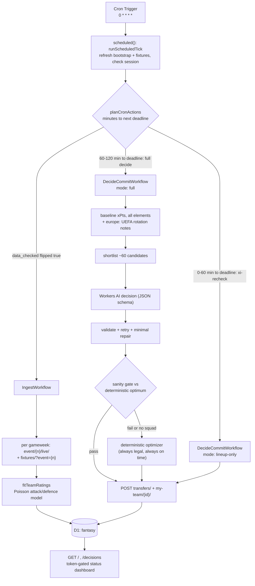
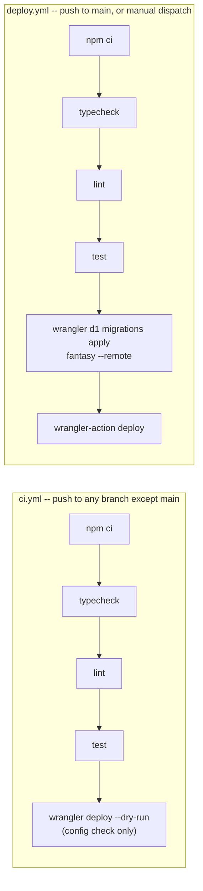

# Fantasy Liga Portugal Betclic — autonomous agent

An agent that plays [Fantasy Liga Portugal Betclic](https://fantasy.ligaportugal.pt/): it ingests
match results and player stats, builds a squad, and sets the lineup and transfers each gameweek.
Runs entirely on the Cloudflare free tier. Team selection and substitution decisions are made by
an LLM (Workers AI), with a deterministic optimizer as both guardrail and fallback.

Design and reasoning: **[issue #1](https://github.com/nimeshjm/fantasy-football/issues/1)**.

## How it works

A single Cloudflare Worker (`src/index.ts`) exposes an hourly Cron Trigger and a small token-gated
HTTP surface. The cron tick (`src/cron.ts`) reads gameweek deadlines out of D1 and decides what to
do — ingest finished-gameweek stats, run a full decide-and-commit, or re-check the lineup — without
any match day ever being hardcoded.



The LLM decides; code guarantees legality. Every option it is offered is pre-validated, its output
is checked against every hard rule, and a per-decision sanity gate can override it. Any hard
failure — a schema refusal, an exhausted Neuron budget, a still-illegal squad after repair — falls
back to the deterministic optimizer, which always produces a legal team by the deadline.

## Capabilities

`runDecisionCore` (`src/workflows/decideCommit.ts`) dispatches to one of four paths depending on
gameweek state — the actual decision surface this agent has:

- **Squad building** (`runSquadCreation`) — a fresh 15-player squad from scratch via
  `entry-create/`, for a brand-new entry with no existing team. Expected at most once per season.
  The exact 15 is chosen by `src/optimizer/squad.ts`: a bounded, horizon-weighted search over
  legal squads, aware of the starting XI it will field, not just raw total value.
- **Transfers + lineup** (`runTransferAndLineup`) — the steady-state weekly path once a squad
  exists: generate every legal single transfer plus a bounded search over doubles
  (`src/optimizer/transfers.ts`), let the LLM pick among pre-validated candidates (or make none),
  then solve the best legal starting XI, bench order, and captain/vice
  (`src/optimizer/lineup.ts`) — an exact solve over the small formation space, not a heuristic.
  `MAX_TRANSFERS_PER_GW` (default 1, no points hits in v1) and the season-long 20-transfer cap are
  enforced regardless of what the LLM proposes.
- **Lineup-only re-check** (`runLineupOnly`) — fired in the `[0, 60)`-minutes-to-deadline window
  (`xi-recheck` in `src/cron.ts`) to react to news between the full decision and kickoff, without
  touching transfers.
- **Fail-closed abstention** (`abortForBlankFixtures`) — if D1 has zero fixtures stored for the
  gameweek (issue #24), every path above would be reasoning from all-zero projections. The agent
  refuses to decide or commit, alerts, and leaves the previously-committed lineup in place, rather
  than doing something confidently wrong.

### Mid-week games: UEFA rotation-risk signal

Portuguese clubs playing in European competition midweek face rotation risk their weekend Liga
fixture doesn't otherwise flag. `src/uefaRotation.ts` (issue #51) pulls recent UEFA
appearances/substitutions from api-football.com for each club represented in the owned squad, and
folds a compact `europe:` note (e.g. `subbed 61' vs Milan (UEL)`) into the shortlist prompt so the
LLM sees it before proposing a lineup or transfer.

Caveats baked into the design, not afterthoughts:

- API-Football's player ids share no id space with this project's `element.id`, so matching is by
  normalized name only (diacritics/punctuation stripped), and deliberately narrow — an ambiguous
  or unmatched name returns `null` rather than guessing, so a miss just means no note that cycle,
  never a note on the wrong player.
- `API_FOOTBALL_KEY` unset is a normal, silent no-op — the signal is simply absent, never a
  failure, and nothing in `test`/CI needs a stub for it.
- A separate midweek wrinkle lives in scoring, not this signal: a rescheduled double gameweek is
  two fixtures scored and summed independently (`floor(n/2)` does not distribute over addition —
  see [Scoring](#scoring)), which this signal doesn't touch.

## Scoring

The game is a rebranded Fantasy Premier League engine, but **the scoring is not FPL's** and the
`game_config.scoring` payload omits its divisors. The real rules were recovered by aggregating
every `explain[]` block from `event/{1..4}/live/` across all 656 players, and are verified in
`test/scoring.test.ts` against 2,322 player-fixture rows.

The differences that matter:

| Stat | This game | FPL |
|---|---|---|
| saves | `floor(n / 2)` | `floor(n / 3)` |
| shots on target | `floor(n / 2)`, all outfield positions | not scored at all |
| goals conceded | `-floor(n / 2)` (GK/DEF) | `-floor(n / 2)` |
| goals | GK/DEF 6, MID 5, FWD 4 | GK/DEF 6, MID 5, FWD 4 |

Shots on target scoring at all — and saves at `/2` rather than `/3` — makes shot-volume forwards
and high-workload goalkeepers worth materially more than FPL intuition suggests, and attacking
full-backs earn shot points too.

Two rules that are easy to get wrong and are guarded by tests:

- Appearance points require `minutes > 0`, but **cards score without an appearance** — an unused
  substitute booked on the bench scores −1.
- The `floor(n/2)` divisors **do not distribute over addition**: 3 saves in each of two fixtures is
  2 points, not `floor(6/2) = 3`. Scoring is therefore per-fixture and summed, never applied to a
  gameweek total. This only bites on a rescheduled double gameweek, and it bites silently.

## Evaluating the model

`eval/` is a small benchmark for the three LLM decisions, so a prompt change,
a `max_tokens` change or a model swap can be scored before it ships. Five axes
are reported separately and never collapsed into one number: schema
conformance, rules legality, regret against the deterministic optimizer (next
to a differentiation stat, because zero regret at zero differentiation means
the model added nothing), realized points, and cost in Neurons.

`npm run test` runs it offline. A live run spends real Neurons on the same
free-tier account this agent draws from, so it is opt-in and capped:

```bash
EVAL_LIVE=1 npm run eval      # needs CLOUDFLARE_API_TOKEN + CLOUDFLARE_ACCOUNT_ID
```

See `eval/README.md` for the lanes, the measured costs, and the limits of what
three gameweeks of fixtures can honestly show.

## Safety

Writes to the live account are irreversible and cost points, so:

- `DRY_RUN` is **`false`** — the agent posts to the live account. It shipped `true` and was
  flipped in `2c9db47` once the rails below were in place.
- One transfer per gameweek by default; no points hits in v1.
- No chip is ever played automatically — `pdbus` / `2capt` / `uteam` semantics are inferred, not
  documented.
- The season-long 20-transfer cap is tracked cumulatively.
- A kill switch in the `config` table halts all writes without a redeploy.
- Every decision, prompt, validation outcome and write is logged for audit.

## Session health

The `sessionid` is a pasted secret (`SESSION_PROVIDER=manual`) because the
site rejects `POST player/login/` for this account. It expires and cannot
re-authenticate itself, and the failure is quiet: the agent still commits a
legal team, it just stops reading the injury text. So the tick logs a
`session-health` heartbeat every hour, and **three consecutive failures POST
to `ALERT_WEBHOOK_URL`** — once per incident, latched only on actual
delivery, cleared automatically on recovery.

Two limits worth knowing:

- **The kill switch silences alerting too.** `config.enabled = 0` returns
  before any write, heartbeat included, so a disabled agent says nothing
  about a dead cookie. That is the deliberate cost of "no writes at all"
  being absolute.
- **This cannot detect a dead cron.** The streak is counted in beats, not
  elapsed time, so a Cloudflare cron outage raises no false alarm — and
  equally raises no alarm. Catching that needs an external dead-man's switch.

`CONTRIBUTING.md` covers rotating the cookie, reading the observed lifetime
out of the heartbeat archive, and the `/admin/login-probe` route.

## Dashboard

The Worker's `fetch` handler serves a small token-gated HTTP surface alongside the cron
(`src/dashboard.ts`, `src/loginProbe.ts`):

| Route | Purpose |
|---|---|
| `GET /` | Status dashboard: session health, dry-run/kill-switch state, Neuron spend, recent decisions |
| `GET /decisions` | Paginated decision history |
| `GET /decisions/:id` | One decision's full detail (prompt, LLM output, validation, gate outcome) |
| `POST /admin/login-probe` | Best-effort check of the password provider, rate-limited to 1/min |

All of it is gated by `DASHBOARD_TOKEN` (`?token=`), and every failure mode — missing token, wrong
token, unconfigured — returns a bare 404, never a 401, so a request can't distinguish "no dashboard
here" from "wrong token." Every interpolated value (names, injury text, LLM reasoning) is
HTML-escaped before rendering, since it's all free text from a live API or an LLM.

## Deployment

Two GitHub Actions workflows, deliberately mutually exclusive so only one path ever touches
Cloudflare credentials:



- `ci.yml` needs no Cloudflare credentials — it validates `wrangler.jsonc` with `--dry-run` only.
- `deploy.yml` runs migrations *before* deploying, and its `deploy-production` concurrency group
  queues overlapping runs rather than cancelling one mid-migration.
- Neither workflow ever sees the fantasy site credentials — see [Secrets](#secrets-and-variables)
  below.

### First-time deploy

`wrangler.jsonc`'s `database_id` already points at this repo's live `fantasy` D1 database — leave it
as-is. Forking this to run your own instance instead:

```bash
npx wrangler d1 create fantasy        # prints a new database_id — paste it into wrangler.jsonc
npm run migrate:remote                # needs CLOUDFLARE_API_TOKEN + CLOUDFLARE_ACCOUNT_ID in your shell
npx wrangler secret put DASHBOARD_TOKEN
npx wrangler secret put FANTASY_SESSION_COOKIE   # see CONTRIBUTING.md for how to obtain it
```

Then push to `main` (or `workflow_dispatch` the `Deploy` workflow) with `CLOUDFLARE_API_TOKEN` and
`CLOUDFLARE_ACCOUNT_ID` set as GitHub repo secrets — `deploy.yml` applies migrations on every push,
so a first deploy needs no separate manual migration step beyond having the database created.

## Secrets and variables

Requires a Cloudflare account and a Fantasy Liga Portugal account. Configuration lives in four
places, each with a different trust level — see `CONTRIBUTING.md` for the full rotation/rationale
detail:

| Tier | Where | Set via | Examples |
|---|---|---|---|
| 1. Non-secret config | `wrangler.jsonc` `vars` (checked in) | edit the file | `DRY_RUN`, `LLM_MODEL`, `MAX_TRANSFERS_PER_GW`, `SQUAD_MARGIN`, `LINEUP_ABS_FLOOR`, `NEURON_DAILY_CAP`, `ENTRY_NAME`/`ENTRY_FAVOURITE_TEAM`/`ENTRY_REGION`, `SESSION_PROVIDER`, `FANTASY_BASE_URL` |
| 2. Worker secrets | encrypted, per-deployment | `wrangler secret put <NAME>` | `FANTASY_SESSION_COOKIE` (required, `manual` provider), `DASHBOARD_TOKEN` (required), `FANTASY_EMAIL`/`FANTASY_PASSWORD` (password provider only), `ALERT_WEBHOOK_URL` (optional, must be `https:`), `API_FOOTBALL_KEY` (optional — enables the [UEFA rotation-risk signal](#mid-week-games-uefa-rotation-risk-signal); absent is a silent no-op, not a failure) |
| 3. GitHub repo secrets | GitHub Actions only | repo Settings → Secrets → Actions | `CLOUDFLARE_API_TOKEN`, `CLOUDFLARE_ACCOUNT_ID` — the *only* two secrets CI/CD ever sees |
| 4. Runtime overrides | D1 `config` table | SQL against the live database | `enabled` (kill switch, halts all writes with no redeploy), `dry_run` (OR'd with `env.DRY_RUN` — can force dry-run on without a redeploy, can't force it off), `session_alert_open` (latch, cleared automatically on recovery) |

**This repo is public.** Fantasy site credentials (tier 2) are set once, by hand, directly against
the deployed Worker with `wrangler secret put` — they must never be committed, put in a workflow
file, or set through CI. Tier 3 is the only thing GitHub itself ever holds, and it's scoped to
authenticating `wrangler`, not to the fantasy site.

See `CONTRIBUTING.md` for local development, rotating the session cookie, and the full secrets
rationale.
